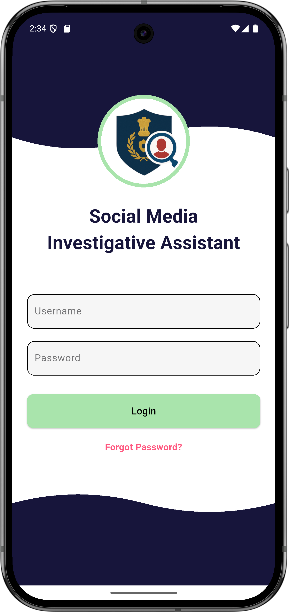
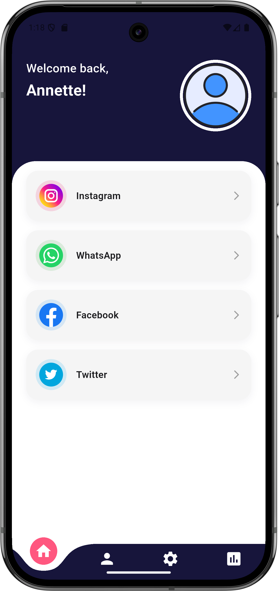
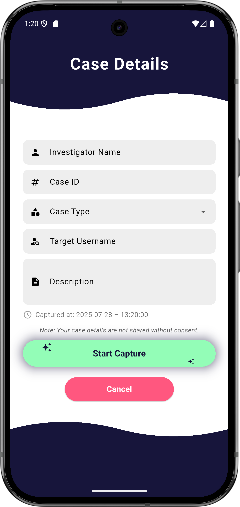
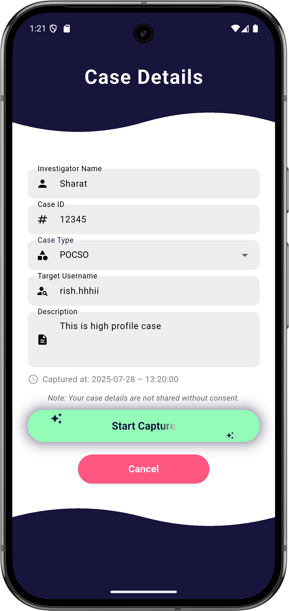
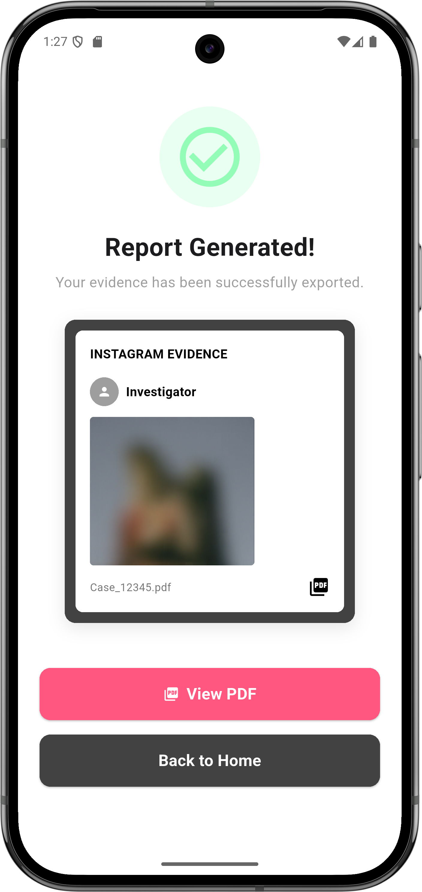
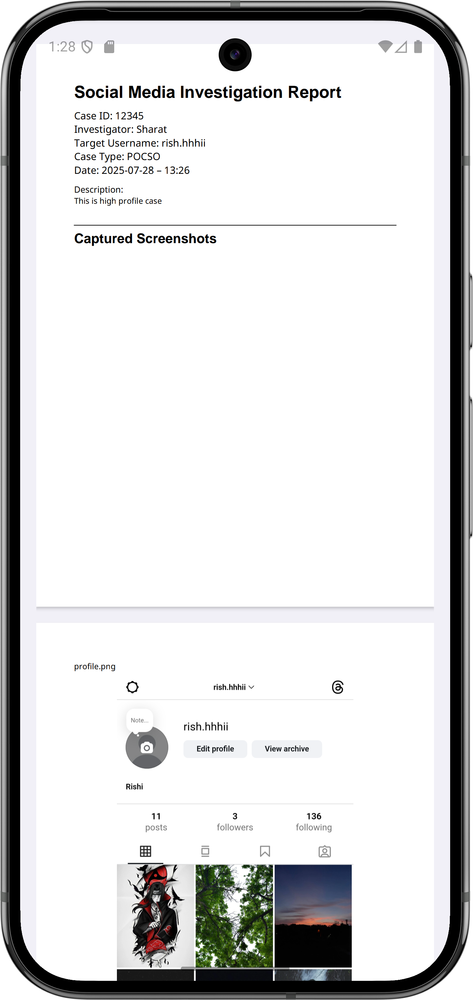
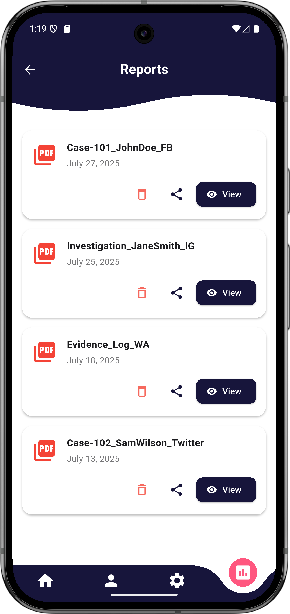
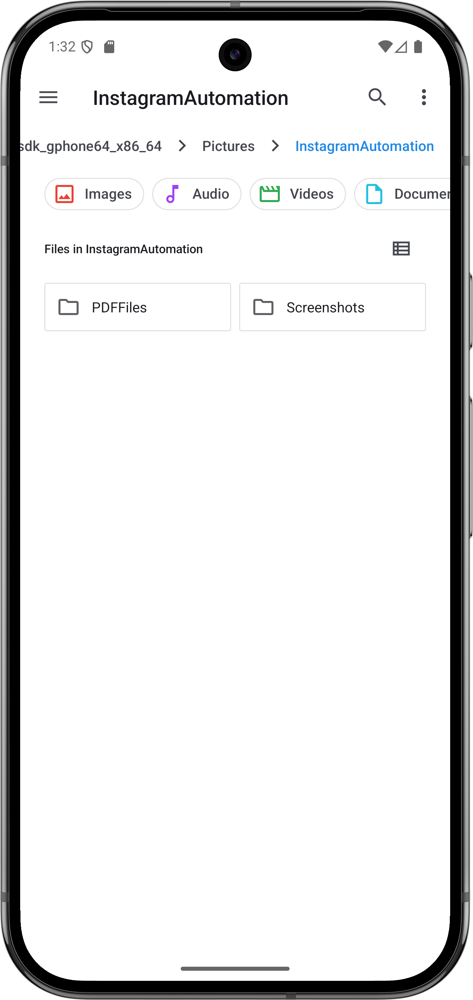
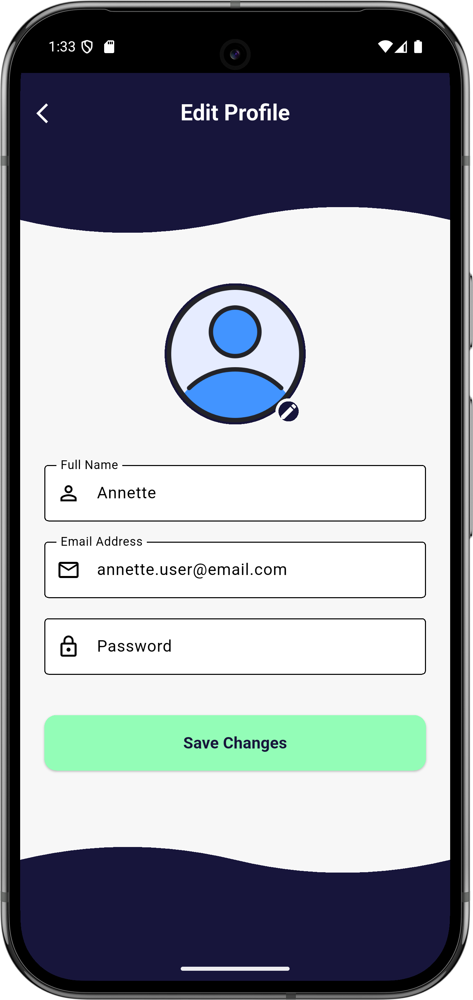
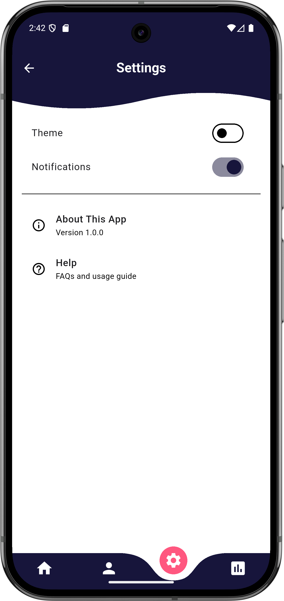

# Social Media Investigative Assistant (SMIA) for Law Enforcement

**A mobile-assisted digital forensic system for structured social media evidence documentation**

---

## 📌 Overview

The **Social Media Investigative Assistant (SMIA)** is an Android-based digital forensic application designed to support **law enforcement agencies and authorized investigative teams** in documenting social media activity in a structured, consistent, and legally usable manner.

The system focuses on **visual evidence documentation** rather than raw data extraction, enabling investigators to generate **timestamped, case-ready PDF reports** suitable for official records and legal proceedings.  
The current implementation is focused on **Instagram**, with an architecture designed for future extensibility.

---
## Table of Contents
1. [Overview](#overview)
2. [Motivation](#motivation)
3. [Key Features](#-key-features)
4. [Platform Scope](#platform-scope)
5. [Demonstration & Evaluation](#demonstration--evaluation)
6. [Security & Compliance Considerations](#security--compliance-considerations)
7. [Screenshots](#-screenshots)
8. [Future Scope](#future-scope)
9. [Disclaimer](#disclaimer)
10. [License](#license)

---

## 🎯 Motivation

Investigations involving social media platforms are often conducted using manual techniques such as screenshots, handwritten notes, and fragmented digital records. These methods are:

- Time-consuming and repetitive  
- Prone to human error  
- Difficult to standardise  
- Inconsistent for legal documentation  

SMIA addresses these limitations by introducing a **structured, mobile-assisted workflow** that simplifies evidence collection and ensures consistency across investigation sessions.

---

## ✨ Key Features

- Secure investigator authentication
- Case-based investigation workflow
- WebView-based assisted navigation of social media platforms
- High-resolution visual evidence capture (screenshots)
- Automatic compilation of captured visuals into timestamped PDF reports
- Local secure storage for sensitive evidence files
- Hybrid storage model with cloud-based metadata logging
- Role-based access control and audit logging
- Designed for usability by non-technical personnel

---

## 🛠️ Technologies Used

-  **Flutter:** – Cross-platform mobile application framework  

-  **Firebase:** – Authentication, metadata storage
- **Android Native** (Kotlin) for automation and screenshot capture
- **WebView** (InAppWebView) for assisted social media navigation

---
## 📱 Platform Scope

- **Current implementation focus:** Instagram  
- **Design intent:** Extensible to additional social media platforms such as Facebook and Twitter

The application captures **visual evidence only** and does not perform raw data scraping or direct backend data extraction.

---

## ▶️ Demonstration & Evaluation

This repository does **not** provide a public APK download.

A demonstration APK is available **upon request** for:
- Academic evaluation
- Authorised institutional review
- Project demonstrations

Requests should include appropriate context and justification.

---

## 🔐 Security & Compliance Considerations

- Authorised access only
- No automated bypass of platform security mechanisms
- No credential harvesting or private API usage
- Visual-only evidence capture ensures authenticity
- Timestamped documentation supports traceability and auditability
- Local retention of sensitive evidence reduces exposure risk

---

## 📸 Screenshots
- Below are selected screenshots illustrating the primary workflows of the application.  
- All sensitive or identifying information has been blurred for privacy.
- Are provided for **demonstration purposes only**

    
    &nbsp;&nbsp;&nbsp;&nbsp;&nbsp;
    
    &nbsp;&nbsp;&nbsp;&nbsp;&nbsp;
    

 

    
    &nbsp;&nbsp;&nbsp;&nbsp;&nbsp;
    
    &nbsp;&nbsp;&nbsp;&nbsp;&nbsp;
    

 

    
    &nbsp;&nbsp;&nbsp;&nbsp;&nbsp;
    
    &nbsp;&nbsp;&nbsp;&nbsp;&nbsp;
    

 

    
    &nbsp;&nbsp;&nbsp;&nbsp;&nbsp;
    
    &nbsp;&nbsp;&nbsp;&nbsp;&nbsp;
    

---

## 🔮 Future Scope

- Support for additional social media platforms
- OCR-based text extraction from captured images
- Image analysis and evidence classification
- Centralised investigation dashboards
- ML-assisted anomaly detection and evidence prioritisation

---

## ⚠️ Disclaimer

Please review the [DISCLAIMER.md](DISCLAIMER.md) file carefully before using or evaluating this project.

---

## 📜 License

This project is licensed under the **MIT License**.
---
## 📩 Contact

For authorised evaluation or demonstration requests, please contact the repository maintainer.
